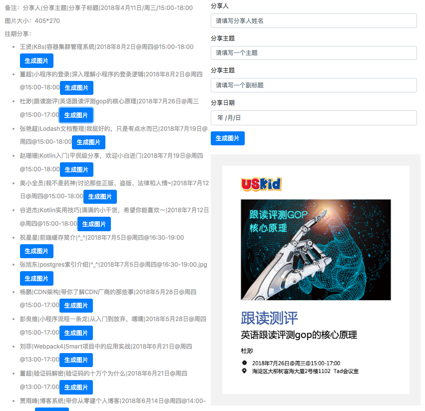

## Custom2image
> Custom2image 是一个基于图片生成的小需求，衍生出来的一个模块驱动。可以实现自定义数据，自定义数据渲染引擎，自定义模板渲染

### 截屏（Screenshots）


### 功能点 (Feature)
* 添加每周分享主题，自动生成图片
* 渲染分享列表记录
* 创建html转图片，对页面进行截屏

### 问题点 (Question)
 * 如何组织模块驱动架构代码
 * 如何抽离业务，提炼抽象层代码
 * 如何处理不同环境调用的问题
 * 如何处理深copy和浅copy的问题
 * 如何暴露接口
 * 如何将任意的html导出图片
 * 处理不同格式的图片
 * 完善配置文档
  
### Example

[项目地址:https://future-component.github.io/Custom2image/](https://future-component.github.io/Custom2image/)

[展示地址:https://future-component.github.io/Custom2image/example/index.html](https://future-component.github.io/Custom2image/example/index.html)

[GitHub地址:https://github.com/Future-component/Custom2image](https://github.com/Future-component/Custom2image)

[demo地址:https://github.com/Future-component/Custom2image/blob/master/example/index.html](https://github.com/Future-component/Custom2image/blob/master/example/index.html)

### API
```js
{
  "init":"----- 初始化 -----",
  "_load":"----- 数据加载 -----",
  "_fetch":"----- 数据加载 -----",
  "_refresh":"----- 数据渲染 -----",
  "update":"----- 数据更新 -----",
  "initCanves":"----- 初始化canvas -----",
  "downloadImg":"----- 下载图片 -----",
  "extend":"----- 浅拷贝扩展函数 -----",
  "deepExtend":"----- 深拷贝扩展函数 -----"
}
```

#### init
参数 | 类型 | 含义 | 例子
:---|:---|:---|:----
element | dom | canvas的元素节点 | document.getElementById('mycanvas')
download | object | 下载图片的参数 | { type: 'PNG' \| 'JPEG' \| 'SVG', auto: false \| true }
data | json | 数据源 | {} 任意
module | json | 数据渲染模板 | {} 和数据源对应
template | json | canvas模板 | {} 可以自定义画布样式

#### 数据源（data）
```js
{
  "detail": {
		"title": "detail-title",
		"subTitle": "detail-subTitle",
		"mc": "mc",
		"schedule": "2018-8-2",
		"address": "富海大厦"
	},
	"html": {
		"h1": "你好"
	},
}
```

#### 数据渲染模板（module）
```js
{
  "detail": {
    "view": document.getElementById('shareList'),
    "refresh": function() {
      console.log(this.data)
    }
  },
  "html": {
    "view": document.getElementById('html'),
    "refresh": function() {
      var self = this;
      var ele = `<h1>${this.data.h1}</h1>`;
      this.view.innerHTML = ele;
    },
  },
}
```

#### 画布模板 (template)
```js
{
  "width": 400,
  "height": 600,
  "backgroundColor": "#007bff",
  "position": [0, 0],
  "data": {
    "bgImg": {
      "type": "image",
      "src": "./images/bg1.jpg",
      "position": [0, 0],
      "size": [400, 600]
    },
    "title": {
      "type": "text",
      "fillStyle": "#fff",
      "font": "38px LiDeBiao-Xing313a04d1d3b1dada",
      "position": [50, 220]
    },
    "mc": {
      "type": "text",
      "fillStyle": "#fff",
      "font": "16px Microsoft YaHei",
      "position": [50, 300]
    }
  }
}
```

### 未来扩展

* 实现可视化设计
* 基于AI，机器学习，自动生成广告图片