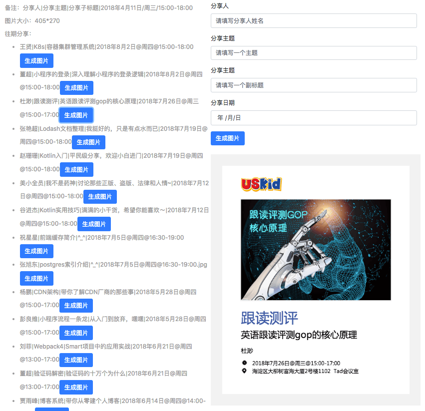

## Custom2image
> Custom2image 是一个基于图片生成的小需求，衍生出来的一个模块驱动。可以实现自定义数据，自定义数据渲染引擎，自定义模板渲染

#### 截屏（Screenshots）

#### 功能点 (Feature)
* 添加每周分享主题，自动生成图片
* 渲染分享列表记录
* 创建html转图片，对页面进行截屏

#### 问题点 (Question)
 * 如何组织模块驱动架构代码
 * 如何抽离业务，提炼抽象层代码
 * 如何处理不同环境调用的问题
 * 如何处理深copy和浅copy的问题
 * 如何暴露接口
 * 如何将任意的html导出图片
 * 处理不同格式的图片
 * 完善配置文档
  
#### Example

[项目地址]()

[展示地址]()

[GitHub地址]()

#### API

#### 未来扩展

* 实现可视化设计
* 基于AI，机器学习，自动生成广告图片